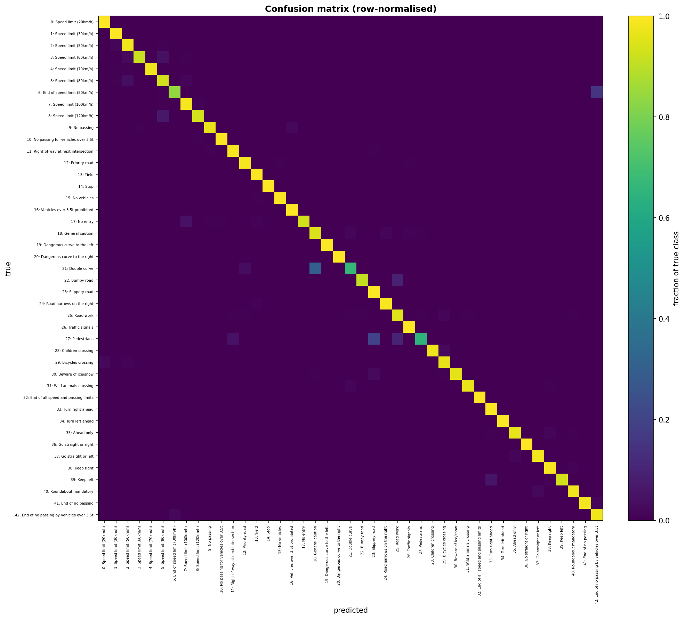
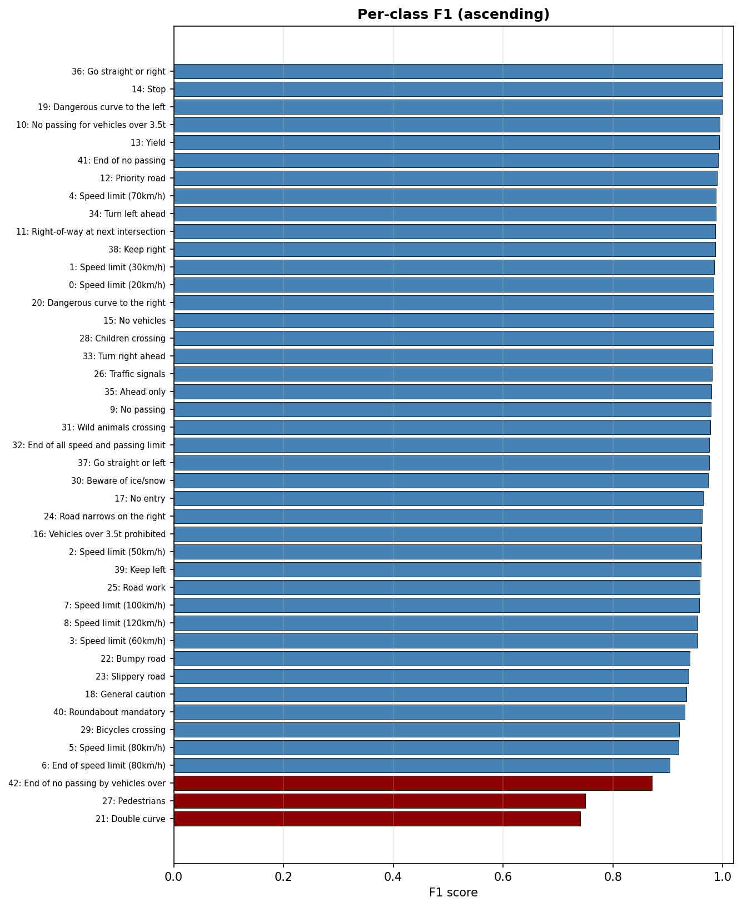
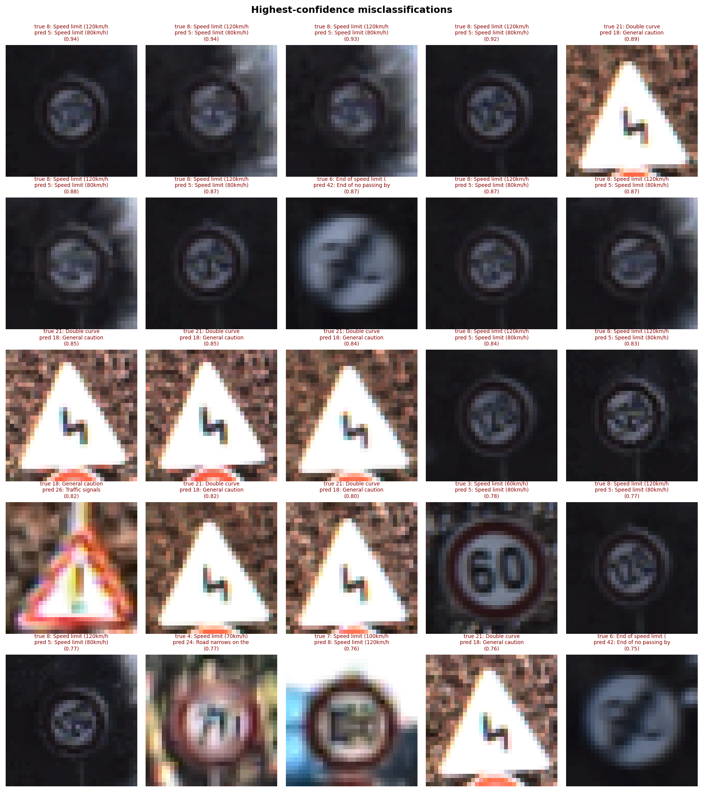
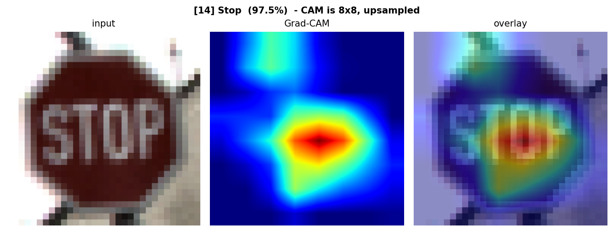
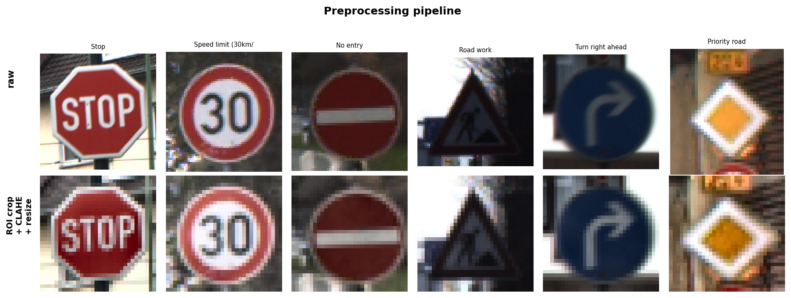
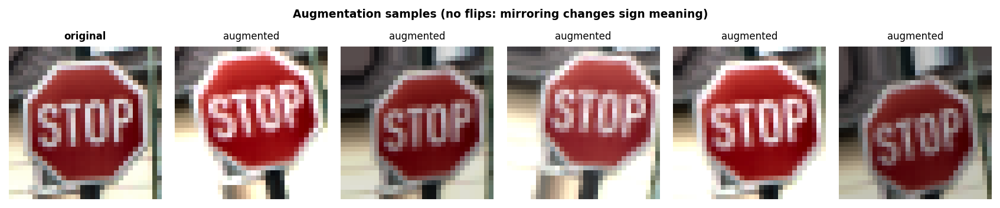
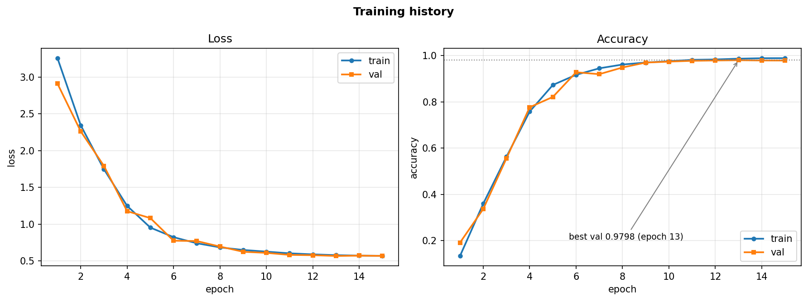
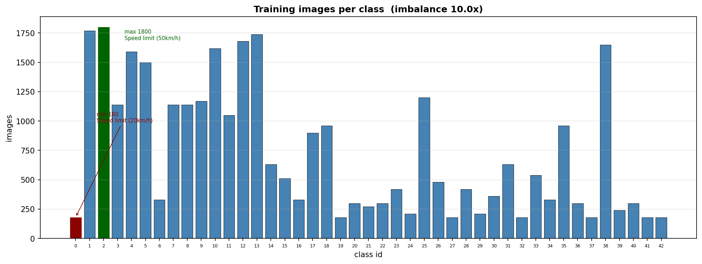

# GTSRB Traffic Sign Recognition

A convolutional neural network trained from scratch to classify German traffic
signs into 43 categories. Everything runs from the command line — no notebook,
no GUI, no GPU.

| | |
|---|---|
| dataset | GTSRB — 39,209 training / 12,630 test images, 43 classes |
| model | TrafficSignNet, 99,019 parameters, written from scratch in PyTorch |
| test accuracy | **96.82%** |
| hardware | CPU only (no CUDA required) |
| training time | ~20 min (15 epochs) on 8 CPU threads |

The validation split is built **by track, not by image**. GTSRB stores about 30
consecutive video frames of each physical sign, so a naive random split puts
near-duplicate frames on both sides and reports a meaningless ~99.9%. See
[Why the split matters](#why-the-split-matters).

---

## Contents

- [Quickstart](#quickstart)
- [Commands](#commands)
- [Results](#results)
- [Ablations](#ablations)
- [Project report](#project-report)
- [Why the split matters](#why-the-split-matters)
- [Method](#method)
- [Project layout](#project-layout)
- [Tests](#tests)
- [Troubleshooting](#troubleshooting)
- [Reproducibility](#reproducibility)
- [References](#references)

---

## Quickstart

Requires **Python 3.10 or newer**. Roughly 1.5 GB of free disk space and 2 GB of
RAM. No GPU needed.

### 1. Get the code

```bash
git clone https://github.com/tanmayai23/gtsrb-traffic-sign-recognition.git
cd gtsrb-traffic-sign-recognition
```

### 2. Create a virtual environment

**Windows (PowerShell)**
```powershell
python -m venv .venv
.\.venv\Scripts\Activate.ps1
```

**Linux / macOS (bash)**
```bash
python3 -m venv .venv
source .venv/bin/activate
```

### 3. Install dependencies

Install the CPU build of PyTorch first — otherwise pip downloads the ~2.5 GB
CUDA build, which is useless without an NVIDIA GPU.

```bash
pip install --upgrade pip
pip install torch==2.8.0 --index-url https://download.pytorch.org/whl/cpu
pip install -r requirements.txt
```

### 4. Check the installation

```bash
python -m src.cli info
```

Prints the torch version, device, parameter count and what data is present.

### 5. Try it immediately (no training required)

A trained checkpoint is committed, so inference works straight away:

```bash
python -m src.cli predict --image samples/sample_stop.ppm
python -m src.cli gradcam --image samples/sample_stop.ppm
```

### 6. Reproduce the full pipeline

```bash
python -m src.cli prepare     # download ~365 MB + build the split  (~6 min, once)
python -m src.cli train       # train the CNN                       (~20 min, CPU)
python -m src.cli evaluate    # metrics + figures on the test set   (~1 min)
```

Or run all of it at once:

```bash
bash run_all.sh          # Linux / macOS / Git Bash
.\run_all.ps1            # Windows PowerShell
```

**In a hurry?** `python -m src.cli train --quick` trains on a small subset for
one epoch in under a minute. It exercises every code path and is the fastest way
to confirm the project works end to end.

---

## Commands

Everything is reachable through one entry point:

```bash
python -m src.cli <command> [options]
python -m src.cli --help
python -m src.cli <command> --help
```

| command | what it does |
|---|---|
| `prepare` | download GTSRB, extract it, build track-aware manifests |
| `train` | train the CNN and checkpoint the best model |
| `evaluate` | accuracy, per-class metrics, confusion matrix, error grid |
| `predict` | classify a single image |
| `gradcam` | save a Grad-CAM heatmap explaining one prediction |
| `figures` | write the preprocessing and augmentation figures |
| `report` | regenerate every report figure and build the report (HTML + PDF) |
| `info` | environment and project status |
| `classes` | list the 43 class ids and names |

### Examples

```bash
# rebuild the split with a different validation fraction
python -m src.cli prepare --val-frac 0.25 --seed 7

# ablations
python -m src.cli train --no-clahe               # without contrast equalisation
python -m src.cli train --balance none           # without class rebalancing
python -m src.cli train --img-size 48            # higher input resolution
python -m src.cli train --width-mult 0.5         # half-width model

# evaluate on validation instead of test
python -m src.cli evaluate --split val

# machine-readable prediction, for scripting
python -m src.cli predict --image path/to/sign.ppm --json

# explain a specific class rather than the predicted one
python -m src.cli gradcam --image path/to/sign.ppm --target-class 14
```

Expected runtimes on a 12-core CPU:

| step | time |
|---|---|
| `prepare` | ~6 min (mostly the 365 MB download; cached afterwards) |
| `train` | ~20 min for 15 epochs |
| `train --quick` | < 1 min |
| `evaluate` | ~1 min |
| `report` | ~20 s |
| `predict` / `gradcam` | < 5 s |

---

## Results

<!-- RESULTS_START -->
### Headline

| metric | value |
|---|---|
| **test accuracy** | **0.9682** (12,228 / 12,630 correct) |
| balanced accuracy | 0.9582 |
| macro F1 | 0.9567 |
| weighted F1 | 0.9680 |
| top-5 accuracy | 0.9956 |
| errors | 402 of 12,630 |
| inference | 0.67 ms/image (CPU, batch 256) |
| best validation accuracy | 0.9798 |

Measured on the **official GTSRB test set** (12,630 images), which is
recorded separately from the training data and never touched during training.

Balanced accuracy and macro F1 are reported alongside raw accuracy because the
classes are imbalanced about 10x — plain accuracy is flattered by good
performance on the common speed-limit signs.

The gap between validation (0.9798) and test
(0.9682) is small, which is what a non-leaking split should produce.

### Where it fails



Hardest classes:

| class | name | precision | recall | F1 | support |
|---|---|---|---|---|---|
| 21 | Double curve | 0.833 | 0.667 | 0.741 | 90 |
| 27 | Pedestrians | 0.886 | 0.650 | 0.750 | 60 |
| 42 | End of no passing by vehicles over 3.5t | 0.786 | 0.978 | 0.871 | 90 |
| 6 | End of speed limit (80km/h) | 0.977 | 0.840 | 0.903 | 150 |
| 5 | Speed limit (80km/h) | 0.909 | 0.932 | 0.920 | 630 |
| 29 | Bicycles crossing | 0.879 | 0.967 | 0.921 | 90 |

Most frequent confusions:

| true | predicted | count |
|---|---|---|
| 8 Speed limit (120km/h) | 5 Speed limit (80km/h) | 29 |
| 21 Double curve | 18 General caution | 27 |
| 5 Speed limit (80km/h) | 2 Speed limit (50km/h) | 23 |
| 6 End of speed limit (80km/h) | 42 End of no passing by vehicles over 3.5t | 23 |
| 3 Speed limit (60km/h) | 5 Speed limit (80km/h) | 20 |
| 17 No entry | 7 Speed limit (100km/h) | 17 |
| 2 Speed limit (50km/h) | 1 Speed limit (30km/h) | 12 |
| 5 Speed limit (80km/h) | 7 Speed limit (100km/h) | 12 |

The failure pattern is coherent rather than random, and follows directly from the
32x32 input: speed-limit signs differ only in small digits that survive
downsampling poorly (Speed limit (120km/h) to Speed limit (80km/h) is the most
common single error), and the warning triangles differ only in a small central
pictogram. Raising the input resolution is the obvious next step; it costs about
2x the training time.



The highest-confidence mistakes are the informative ones — these are cases the
model got wrong while being sure:



### Ablations

Each row is a full 15-epoch retrain with one design decision removed, evaluated
on the same official test set. Raw data in `ablations/*/metrics.json`.

| setting | command | accuracy | balanced acc | macro F1 | params | Δ acc (pp) |
|---|---|---|---|---|---|---|
| Baseline (all decisions on) | `train` | 0.9682 | 0.9582 | 0.9567 | 99,019 | — |
| Without CLAHE | `train --no-clahe` | 0.9519 | 0.9403 | 0.9373 | 99,019 | -1.62 |
| Without class rebalancing | `train --balance none` | 0.9631 | 0.9467 | 0.9503 | 99,019 | -0.51 |
| Half-width model | `train --width-mult 0.5` | 0.9143 | 0.9203 | 0.9073 | 26,491 | -5.39 |

Reproduce with `bash run_ablations.sh` (~70 min total on CPU).

**What this shows.** Every design decision earns its place:

- **CLAHE is the single largest preprocessing contributor** (+1.62 pp). GTSRB is
  dashcam footage with severe under- and over-exposure, so normalising local
  contrast matters more than any other preprocessing step.
- **Class rebalancing gives a smaller but real gain** (+0.51 pp accuracy,
  +1.15 pp balanced accuracy). The larger effect on *balanced* accuracy is the
  expected signature: rebalancing helps the rare classes specifically, which is
  exactly what it is for.
- **Capacity is not oversized.** Halving the width costs 5.39 pp for a model of
  26,491 parameters, so the 99k baseline is not padded — those parameters work.

### Explainability

Grad-CAM over the last convolutional layer, showing the network attends to the
sign face rather than the surrounding scene:



Full artefacts: `results/metrics.json`, `results/per_class_metrics_test.csv`,
`results/top_confusions_test.csv`, `results/classification_report_test.txt`.

<!-- RESULTS_END -->

---

## Project report

A full write-up is included, covering method, results, error analysis, ablations
and limitations:

- **[`report/GTSRB_Project_Report.pdf`](report/GTSRB_Project_Report.pdf)** — 16 pages
- [`report/report.html`](report/report.html) — the same document, figures embedded

Rebuild both from the current metrics with:

```bash
python -m src.cli report
```

Every number and figure in the report is read from `results/metrics.json` and the
ablation runs, so it cannot drift from the code. PDF export uses Chrome or Edge
if one is installed; otherwise the HTML prints to PDF from any browser.

---

## Why the split matters

This is the most important design decision in the project.

GTSRB filenames encode `{track}_{frame}.ppm`. For example `00053_00024.ppm` is
frame 24 of track 53. **A track is about 30 consecutive video frames of the same
physical sign**, so the 39,209 training images depict only **1,307 distinct
signs**.

Splitting on individual images puts frame 11 in training and frame 12 in
validation. Those two frames are nearly identical, so the model is validated on
pictures it has effectively memorised. The reported accuracy climbs toward 99.9%
and measures nothing.

This project assigns **whole tracks** to one side or the other, stratified so
every class appears in both:

| | images | tracks |
|---|---|---|
| train | 31,379 | 1,046 |
| val | 7,830 | 261 |
| **overlap** | **0** | **0** |

A second, easy-to-miss trap: track numbers restart at zero inside each class
directory, so a bare `00000` prefix exists in class 0 *and* class 1 and they are
unrelated. The identifier has to be the composite `(class_id, track_number)`.

Both properties are asserted when the split is built and covered by
`tests/test_split_integrity.py`.

The honest consequence: accuracy here is lower than the ~99% often quoted for
GTSRB. That gap is the difference between a leaked validation set and a real one.

---

## Method

### Preprocessing

`load → ROI crop (+10% margin) → CLAHE → resize 32×32 → augment → normalise`



- **ROI crop.** Every image ships with an annotated sign box. Cropping to it
  removes background clutter; the 10% margin keeps the sign's outer rim, which
  is itself a class cue (red triangle versus blue circle).
- **CLAHE** (contrast-limited adaptive histogram equalisation) is applied to the
  **L channel in LAB space only**, clip limit 2.0, 4×4 tiles. Equalising each RGB
  channel separately shifts hue, and colour is class-discriminative for traffic
  signs. The 4×4 grid suits these small crops; OpenCV's 8×8 default leaves ~6 px
  tiles and amplifies noise.
- **Normalisation** statistics are computed over the **training split only**, so
  validation statistics never leak into the model's input scaling.

### Augmentation



Rotation ±12°, translation ±10%, scale 0.9–1.1, shear ±0.1, brightness
×[0.7, 1.3], contrast ×[0.8, 1.2], and occasional light gaussian noise.

Two implementation details that matter:

- All geometry is composed into **one** affine matrix and applied with a single
  `warpAffine`. Chaining three separate warps interpolates three times and
  visibly smears a 32 px image.
- `BORDER_REPLICATE` rather than a zero fill, because black corners would give
  the network an artefact that correlates perfectly with "this sample was
  augmented".

**No horizontal flip, no vertical flip, no 90° rotation.** Mirroring changes
what a sign *means*:

| pair | meaning |
|---|---|
| 33 ↔ 34 | turn right ahead ↔ turn left ahead |
| 19 ↔ 20 | dangerous curve left ↔ dangerous curve right |
| 36 ↔ 37 | go straight or right ↔ go straight or left |
| 0–8 | every speed-limit digit becomes unreadable |

Flip augmentation is a sensible default for natural images and is actively
wrong here. A regression test (`test_never_mirrors_the_image`) enforces it.

### Architecture

| block | layers | output |
|---|---|---|
| 1 | Conv(3→32, 3×3) → BatchNorm → ReLU → MaxPool | 16×16×32 |
| 2 | Conv(32→64, 3×3) → BatchNorm → ReLU → MaxPool | 8×8×64 |
| 3 | Conv(64→128, 3×3) → BatchNorm → ReLU → MaxPool | 4×4×128 |
| head | GlobalAvgPool → Dropout(0.3) → Linear(128→43) | 43 |

**99,019 trainable parameters.**

- Convolutions use `bias=False` because the BatchNorm that follows immediately
  re-centres the output, making a conv bias redundant.
- The global-average-pooling head replaces the usual flatten→Linear: it drops
  ~88k parameters, makes the network accept any input size without code changes,
  and is the canonical arrangement for class activation maps.
- The size was chosen by measurement, not guesswork. At 32×32 with one conv per
  block a full run takes ~20 min on 8 CPU threads; 48×48 and two-conv blocks
  were both roughly 2× slower for gains that did not justify the wait.

### Training

AdamW (lr 1e-3, weight decay 1e-4) with a **OneCycle** schedule peaking at 3e-3,
stepped per batch. Cross-entropy with label smoothing 0.05, gradients clipped at
norm 5.0. A `WeightedRandomSampler` compensates for the 10× class imbalance.
Early stopping on validation accuracy with patience 6, plus a wall-clock guard.



Class imbalance across the training set:



### Explainability

Grad-CAM is implemented directly with forward and full-backward hooks — no
external library. Gradients of the target logit with respect to the last
convolutional layer are averaged per feature map, used as weights, summed and
rectified.

The resulting map is **8×8**, upsampled for display. That is coarse, but enough
to show whether the network is looking at the sign or at the background.

Two mistakes the implementation avoids: it uses `register_full_backward_hook`
(the older `register_backward_hook` reports wrong gradients for multi-input
modules), and it runs with gradients enabled — `model.eval()` for BatchNorm
statistics, but *not* under `no_grad`/`inference_mode`, which would silently
produce an empty map.

---

## Project layout

```
.
├── src/
│   ├── cli.py          single entry point (argparse subcommands)
│   ├── config.py       run configuration + the 43 class names
│   ├── download.py     resumable download, safe extraction
│   ├── prepare.py      annotation parsing + the track-aware split
│   ├── dataset.py      Dataset, RAM cache, imbalance handling
│   ├── transforms.py   ROI crop, CLAHE, resize, augmentation
│   ├── model.py        TrafficSignNet
│   ├── engine.py       train / validate loops
│   ├── train.py        schedule, early stopping, checkpointing
│   ├── evaluate.py     metrics, confusion matrix, error analysis
│   ├── predict.py      single-image inference
│   ├── gradcam.py      hook-based Grad-CAM
│   ├── plots.py        every figure (Agg backend, headless-safe)
│   └── utils.py        seeding, timing, checkpoint/JSON helpers
├── tests/              unittest suite
├── results/            metrics.json + figures (committed)
├── checkpoints/best.pt trained model (committed, ~1.2 MB)
├── samples/            a few test images for the demo commands
├── data/               dataset (gitignored; rebuilt by `prepare`)
└── report_notes.md     working notes
```

`data/` is excluded from git — it is ~365 MB of archives and ~52,000 extracted
images. `python -m src.cli prepare` recreates it exactly.

---

## Tests

```bash
python -m unittest discover tests -v
```

50 tests covering:

- **split logic** (`test_split_logic.py`) — runs on synthetic data, so the
  central claim is verifiable on a fresh clone with no dataset downloaded:
  whole tracks stay together, no image is lost or duplicated, every class
  appears on both sides, the split is deterministic. One test deliberately
  demonstrates that a *random* split leaks tracks — the bug being avoided.
- **split integrity** (`test_split_integrity.py`) — the same properties checked
  against the real manifests once `prepare` has been run (skipped otherwise)
- **transforms** — CLAHE preserves hue and raises contrast, crops respect image
  bounds, augmentation is deterministic per seed, **never mirrors**, and leaves
  no black border
- **model** — output shape, parameter budget, resolution independence, no conv
  bias, gradient flow
- **Grad-CAM** — map shape and normalisation, hook cleanup, correct behaviour in
  eval mode
- **sample integrity** — the shipped `.ppm` images survive a git checkout
  byte-exact. A PPM has an ASCII header before binary pixels, so git can mistake
  it for text and rewrite line endings, silently altering pixel data.

Only `test_split_integrity.py` needs the dataset and skips without it. The
other 43 tests — including the synthetic split-logic suite — run on a bare
clone, so a reviewer can verify the core claims in under a second.

---

## Troubleshooting

**`ModuleNotFoundError: No module named 'src'`**
Run from the repository root using module syntax: `python -m src.cli ...`, not
`python src/cli.py`.

**Download fails or stalls.**
The mirror is a university server and is sometimes slow. Downloads resume, so
just run `python -m src.cli prepare` again. To fetch manually, download the
three archives from
`https://sid.erda.dk/public/archives/daaeac0d7ce1152aea9b61d9f1e19370/`
(`GTSRB_Final_Training_Images.zip`, `GTSRB_Final_Test_Images.zip`,
`GTSRB_Final_Test_GT.zip`), place them in `data/raw/`, and rerun `prepare`.

**`pip install torch` is downloading gigabytes.**
You are getting the CUDA build. Install from the CPU index first:
`pip install torch==2.8.0 --index-url https://download.pytorch.org/whl/cpu`

**`ImportError: libGL.so.1` (headless Linux).**
`pip uninstall opencv-python && pip install opencv-python-headless==4.12.0.88`

**Training is too slow.**
Use `python -m src.cli train --quick`, lower `--epochs`, or set
`--max-minutes` to stop cleanly at a time budget. A checkpoint is written after
every epoch, so an interrupted run is never wasted.

**Out of memory.**
Lower `--batch-size` to 64. The dataset is cached in RAM as uint8 (~96 MB for
the training split); on a very constrained machine, reduce with `--img-size 24`.

---

## Reproducibility

- `random`, `numpy` and `torch` are seeded; `torch.use_deterministic_algorithms(warn_only=True)` is set
- augmentation draws from a per-index generator, so results hold even with
  dataloader workers > 0
- checkpoints are self-describing — they carry the config, class names and
  normalisation statistics, so `predict` and `evaluate` need no matching flags
- **caveat:** run-to-run reproducibility on one machine is reliable; bit-exact
  equality across different machines, BLAS builds or torch versions is not
  guaranteed, and a few CPU kernels have no deterministic variant

---

## References

1. J. Stallkamp, M. Schlipsing, J. Salmen, C. Igel. *The German Traffic Sign
   Recognition Benchmark: A multi-class classification competition.* IJCNN 2011.
2. R. R. Selvaraju et al. *Grad-CAM: Visual Explanations from Deep Networks via
   Gradient-based Localization.* ICCV 2017.
3. S. Ioffe, C. Szegedy. *Batch Normalization: Accelerating Deep Network Training
   by Reducing Internal Covariate Shift.* ICML 2015.
4. L. N. Smith, N. Topin. *Super-Convergence: Very Fast Training of Neural
   Networks Using Large Learning Rates.* 2018.
5. K. Zuiderveld. *Contrast Limited Adaptive Histogram Equalization.*
   Graphics Gems IV, 1994.

The GTSRB dataset is provided by the Institut für Neuroinformatik,
Ruhr-Universität Bochum, for research and educational use.

## License

MIT — see [LICENSE](LICENSE).
